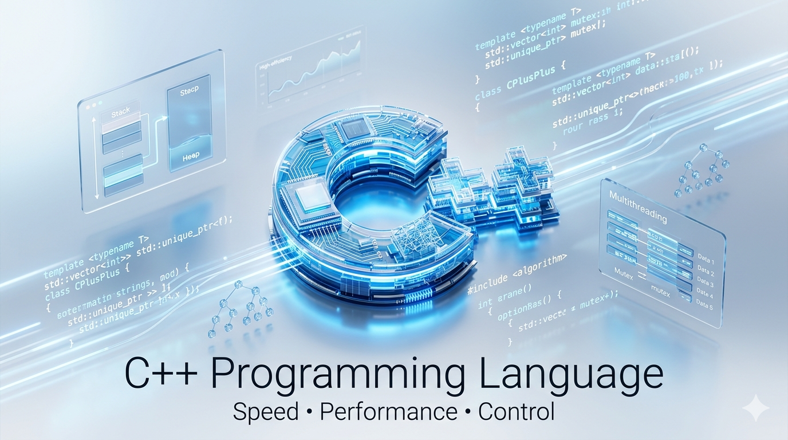

<div align="center">
  
  <h1>🔥 C++ Programming — From Fundamentals to Advanced Systems</h1>
  <p><b>Logic • OOP • STL • Performance</b></p>
  <p><i>Master C++ with deep understanding of object-oriented design, memory, and high-performance coding.</i></p>
  <br/>
  <p>
    
    
    
    
    
    
    
  </p>
</div>

---

## 🚀 Introduction

**C++** is a general-purpose, high-performance programming language created by **Bjarne Stroustrup** in 1979 as an extension of C. It combines the raw power of C with object-oriented, generic, and functional programming paradigms — making it one of the most versatile and widely used languages in the world.

**What makes C++ different from C?**

<div align="center">

| Feature | C | C++ |
|:---|:---:|:---:|
| Paradigm | Procedural only | Multi-paradigm (OOP + Procedural + Generic) |
| Classes & Objects | ✗ | ✔ |
| Standard Template Library | ✗ | ✔ |
| Function Overloading | ✗ | ✔ |
| References | ✗ | ✔ |
| Exception Handling | ✗ | ✔ |
| Templates & Generics | ✗ | ✔ |
| Smart Pointers | ✗ | ✔ |
| RAII & Destructors | ✗ | ✔ |

</div>

**Why C++ is powerful:**
- Full control over memory — manual and smart pointer management
- Zero-cost abstractions — high-level code with low-level performance
- The STL gives you production-grade data structures out of the box
- Templates enable generic, reusable, type-safe code
- Runs on everything — from microcontrollers to supercomputers

**Real-world use:**
- 🎮 **Game Engines** — Unreal Engine, Unity (core), id Tech
- 🖥️ **Operating Systems** — Windows, macOS internals, embedded OS
- ⚡ **High-Frequency Trading** — latency-critical financial systems
- 🧠 **Robotics & AI** — TensorFlow core, ROS, OpenCV
- 🏆 **Competitive Programming** — the dominant language on Codeforces, ICPC

---

## 🎯 Learning Goals

<div align="center">
<table>
  <tr>
    <td align="center" width="20%">
      <br/><br/>
      Syntax, I/O, variables, operators, control flow — rock solid
    </td>
    <td align="center" width="20%">
      <br/><br/>
      Classes, inheritance, polymorphism, abstraction — deeply understood
    </td>
    <td align="center" width="20%">
      <br/><br/>
      vector, map, set, algorithms — used like a pro
    </td>
    <td align="center" width="20%">
      <br/><br/>
      Pointers, smart pointers, RAII — zero leaks, maximum speed
    </td>
    <td align="center" width="20%">
      <br/><br/>
      DSA, problem-solving patterns, competitive programming mindset
    </td>
  </tr>
</table>
</div>

---

## 📚 Complete Roadmap

<div align="center">
<table>
  <tr>
    <td align="center"></td>
    <td><b>Syntax, Variables, Data Types, I/O (cin/cout), Operators</b></td>
    <td align="center">🟢 Start Here</td>
  </tr>
  <tr>
    <td align="center"></td>
    <td><b>if/else, switch, ternary, short-circuit evaluation</b></td>
    <td align="center">🟢 Core Logic</td>
  </tr>
  <tr>
    <td align="center"></td>
    <td><b>Declaration, overloading, default args, inline, recursion</b></td>
    <td align="center">🟢 Modular Code</td>
  </tr>
  <tr>
    <td align="center"></td>
    <td><b>1D/2D arrays, std::string, string methods, char arrays</b></td>
    <td align="center">🟡 Data Handling</td>
  </tr>
  <tr>
    <td align="center"></td>
    <td><b>Raw pointers, references, dynamic allocation, new/delete</b></td>
    <td align="center">🔴 Critical</td>
  </tr>
  <tr>
    <td align="center"></td>
    <td><b>Classes, objects, constructors, destructors, encapsulation, inheritance, polymorphism, abstraction</b></td>
    <td align="center">🔴 Core Pillar</td>
  </tr>
  <tr>
    <td align="center"></td>
    <td><b>vector, map, set, unordered_map, stack, queue, priority_queue, algorithms</b></td>
    <td align="center">🟡 Power Tools</td>
  </tr>
  <tr>
    <td align="center"></td>
    <td><b>ifstream, ofstream, fstream, binary I/O, file modes</b></td>
    <td align="center">🟡 Persistence</td>
  </tr>
  <tr>
    <td align="center"></td>
    <td><b>Templates, smart pointers (unique_ptr, shared_ptr), move semantics, lambdas, C++17 features</b></td>
    <td align="center">🔴 Advanced</td>
  </tr>
  <tr>
    <td align="center"></td>
    <td><b>Linked List, Stack, Queue, Trees, Graphs, Sorting, Searching, DP</b></td>
    <td align="center">🔴 Mastery</td>
  </tr>
</table>
</div>

---

## 📂 Folder Structure

```
CppPathway/
├── assets/
│   └── C++.png
├── .gitignore
├── LICENSE
└── README.md
```

> 📁 `src/` will be added progressively — `basics/` → `control-flow/` → `functions/` → `arrays-strings/` → `pointers/` → `oop/` → `stl/` → `file-handling/` → `advanced/` → `dsa/`


---

## 💡 Concepts Covered

<table>
  <tr>
    <td width="50%" valign="top">

**Core Concepts**
- 📌 Variables & Data Types (`int`, `float`, `double`, `char`, `bool`, `auto`)
- 📌 Operators (arithmetic, logical, bitwise, relational, assignment)
- 📌 Control Flow (`if/else`, `switch`, ternary)
- 📌 Loops (`for`, `while`, `do-while`, range-based `for`)
- 📌 Functions (overloading, default args, inline, recursion)
- 📌 Arrays & `std::string` (manipulation, methods)

**OOP Concepts** 🔴
- 🔴 **Classes & Objects** — blueprint and instance
- 🔴 **Constructors & Destructors** — lifecycle management
- 🔴 **Encapsulation** — data hiding with access specifiers
- 🔴 **Inheritance** — single, multiple, multilevel, hierarchical
- 🔴 **Polymorphism** — compile-time & runtime (virtual functions)
- 🔴 **Abstraction** — abstract classes & pure virtual functions
- 🔴 **Operator Overloading** — custom behavior for operators
- 🔴 **Friend Functions & Classes**

    </td>
    <td width="50%" valign="top">

**STL Concepts**
- 📦 `vector` — dynamic array, push_back, iterators
- 📦 `map` / `unordered_map` — key-value pairs, O(log n) vs O(1)
- 📦 `set` / `unordered_set` — unique sorted elements
- 📦 `stack`, `queue`, `priority_queue` — adapter containers
- 📦 `pair`, `tuple` — composite types
- 📦 Algorithms — `sort`, `binary_search`, `find`, `count`, `accumulate`

**Advanced Concepts**
- ⚡ **Templates** — function & class templates, generic programming
- ⚡ **Smart Pointers** — `unique_ptr`, `shared_ptr`, `weak_ptr`
- ⚡ **Move Semantics** — rvalue references, `std::move`
- ⚡ **Lambda Expressions** — anonymous functions, captures
- ⚡ **Exception Handling** — `try`, `catch`, `throw`
- ⚡ **Namespaces** — scope management
- ⚡ **C++17 Features** — structured bindings, `if constexpr`, `std::optional`

    </td>
  </tr>
</table>

> 🔴 **OOP** is the heart of C++ — every concept here is explained with real-world analogies, UML-style diagrams, and clean code. Master it, and you master C++.

---

## 🏛️ OOP Pillars — Deep Dive

<div align="center">
<table>
  <tr>
    <td align="center" width="25%">
      <h3>🔒 Encapsulation</h3>
      Bundling data and methods together. Access specifiers (<code>private</code>, <code>protected</code>, <code>public</code>) protect internal state. Getters & setters provide controlled access.
    </td>
    <td align="center" width="25%">
      <h3>🎭 Abstraction</h3>
      Hiding implementation complexity. Abstract classes with pure virtual functions define interfaces. Users interact with <i>what</i> it does, not <i>how</i>.
    </td>
    <td align="center" width="25%">
      <h3>🧬 Inheritance</h3>
      Deriving new classes from existing ones. Promotes code reuse. Supports single, multiple, multilevel, and hierarchical inheritance. <code>is-a</code> relationship.
    </td>
    <td align="center" width="25%">
      <h3>🔀 Polymorphism</h3>
      One interface, many forms. <b>Compile-time</b> via function/operator overloading. <b>Runtime</b> via virtual functions and vtable dispatch.
    </td>
  </tr>
</table>
</div>

```cpp
// Polymorphism in action
class Shape {
public:
    virtual double area() const = 0;  // pure virtual
    virtual ~Shape() = default;
};

class Circle : public Shape {
    double r;
public:
    Circle(double r) : r(r) {}
    double area() const override { return 3.14159 * r * r; }
};

class Rectangle : public Shape {
    double w, h;
public:
    Rectangle(double w, double h) : w(w), h(h) {}
    double area() const override { return w * h; }
};
```

---

## ⚡ STL Power — Your Competitive Edge

<div align="center">
<table>
  <tr>
    <td align="center" width="33%">
      <h3>📦 Containers</h3>
      <br/>
      <br/>
      <br/>
      <br/>
      
    </td>
    <td align="center" width="33%">
      <h3>🔧 Algorithms</h3>
      <br/>
      <br/>
      <br/>
      <br/>
      
    </td>
    <td align="center" width="33%">
      <h3>🚀 Iterators & Utilities</h3>
      <br/>
      <br/>
      <br/>
      <br/>
      
    </td>
  </tr>
</table>
</div>

```cpp
// STL in competitive programming
#include <bits/stdc++.h>
using namespace std;

int main() {
    vector<int> v = {5, 2, 8, 1, 9, 3};
    sort(v.begin(), v.end());                          // O(n log n)
    bool found = binary_search(v.begin(), v.end(), 8); // O(log n)

    map<string, int> freq;
    for (auto& word : {"cpp", "stl", "cpp"}) freq[word]++;

    priority_queue<int> maxHeap(v.begin(), v.end());   // max heap
    cout << maxHeap.top();                             // 9
}
```

---

## 🏆 Competitive Programming Angle

<div align="center">
<table>
  <tr>
    <td align="center" width="33%">
      <h3>⚡ Fast I/O</h3>
      <pre><code>ios_base::sync_with_stdio(false);
cin.tie(NULL);</code></pre>
      Disables C/C++ stream sync — cuts input time by up to 10x. Add to every competitive solution.
    </td>
    <td align="center" width="33%">
      <h3>🧠 STL Tricks</h3>
      <pre><code>// Frequency map
for(auto x : arr) freq[x]++;

// Custom sort
sort(v.begin(), v.end(),
  [](auto&amp; a, auto&amp; b){
    return a.second &lt; b.second;
  });</code></pre>
    </td>
    <td align="center" width="33%">
      <h3>🎯 Problem-Solving Mindset</h3>
      <br/>
      <br/>
      <br/>
      <br/>
      <br/>
      
      <br/>
    </td>
  </tr>
</table>
</div>

---

## 🧠 Code + Logic Approach

<div align="center">

Every concept follows a strict 5-step learning pattern — no shortcuts.

<br/>


&nbsp;→&nbsp;

&nbsp;→&nbsp;

&nbsp;→&nbsp;

&nbsp;→&nbsp;


<br/><br/>

<table>
  <tr>
    <td align="center" width="20%"><b>📖 Concept</b></td>
    <td align="center" width="20%"><b>🧠 Logic</b></td>
    <td align="center" width="20%"><b>💻 Code</b></td>
    <td align="center" width="20%"><b>⚠️ Edge Cases</b></td>
    <td align="center" width="20%"><b>✅ Best Practices</b></td>
  </tr>
  <tr>
    <td align="center">Understand <i>what</i> it is and <i>why</i> it exists</td>
    <td align="center">Mental model — think before you type</td>
    <td align="center">Clean, modern, well-commented C++</td>
    <td align="center">Null ptrs, overflow, empty containers</td>
    <td align="center">RAII, const-correctness, naming conventions</td>
  </tr>
</table>
</div>

---

## ⚙️ Setup & Run Code

**Prerequisites:** G++ compiler (C++17 support recommended)

```bash
# Install G++ (macOS)
brew install gcc

# Install G++ (Ubuntu/Debian)
sudo apt install g++

# Verify installation
g++ --version
```

**Compile and run any program:**

```bash
# Basic compile
g++ program.cpp -o program
./program

# Recommended — C++17 with warnings
g++ -std=c++17 -Wall -Wextra program.cpp -o program
./program

# With optimizations (competitive programming)
g++ -std=c++17 -O2 program.cpp -o program
```

**Example — Hello C++ World:**

```cpp
#include <iostream>
using namespace std;

int main() {
    cout << "Hello, C++ World!" << endl;
    return 0;
}
```

```bash
g++ -std=c++17 hello.cpp -o hello
./hello
# Output: Hello, C++ World!
```

---

## 📊 Progress Tracker

*Fork this repo and check off topics as you complete them.*

<table>
  <tr>
    <td valign="top" width="50%">

**📦 Basics**
- [ ] Hello World & `cin` / `cout`
- [ ] Variables & Data Types
- [ ] Operators & Expressions
- [ ] Type Casting & `auto`

**🔀 Control Flow**
- [ ] `if` / `else if` / `else`
- [ ] `switch` / `case`
- [ ] Ternary Operator

**🔁 Loops**
- [ ] `for` loop
- [ ] `while` / `do-while`
- [ ] Range-based `for`
- [ ] `break` & `continue`
- [ ] Nested loops & patterns

**🧩 Functions**
- [ ] Declaration & definition
- [ ] Function overloading
- [ ] Default arguments
- [ ] Pass by value / reference
- [ ] Inline functions
- [ ] Recursion

**📐 Arrays & Strings**
- [ ] 1D & 2D arrays
- [ ] `std::string` & methods
- [ ] String manipulation

**🔴 Pointers & Memory**
- [ ] Raw pointers & references
- [ ] Pointer arithmetic
- [ ] `new` / `delete`
- [ ] Smart pointers (`unique_ptr`, `shared_ptr`)
- [ ] Memory leaks & RAII

    </td>
    <td valign="top" width="50%">

**🔴 OOP**
- [ ] Classes & Objects
- [ ] Constructors & Destructors
- [ ] `this` pointer
- [ ] Encapsulation (access specifiers)
- [ ] Inheritance (single, multiple, multilevel)
- [ ] Polymorphism (overloading & virtual)
- [ ] Abstraction & pure virtual functions
- [ ] Operator Overloading
- [ ] Friend functions & classes
- [ ] Copy constructor & assignment operator

**📦 STL**
- [ ] `vector`
- [ ] `map` & `unordered_map`
- [ ] `set` & `unordered_set`
- [ ] `stack`, `queue`, `priority_queue`
- [ ] `pair` & `tuple`
- [ ] `sort`, `binary_search`, `find`
- [ ] Lambda expressions

**📁 File Handling**
- [ ] `ifstream` / `ofstream` / `fstream`
- [ ] Text & binary file I/O
- [ ] File modes

**⚡ Advanced C++**
- [ ] Function & class templates
- [ ] Exception handling
- [ ] Move semantics & `std::move`
- [ ] C++17 features

**🔴 DSA & Problem Solving**
- [ ] Linked List (singly & doubly)
- [ ] Stack & Queue
- [ ] Binary Search Tree
- [ ] Sorting algorithms
- [ ] Dynamic Programming basics
- [ ] Graph traversal (BFS/DFS)

    </td>
  </tr>
</table>

---

## 🏆 Why This Repo is Different

<div align="center">

| ✅ Feature | 💡 What It Means |
|---|---|
| **Logic-First** | Every concept starts with *why*, not just *how* |
| **Modern C++** | C++17 style — no outdated `void main()` or `gets()` |
| **OOP Deep Dive** | All 4 pillars explained with real-world analogies & code |
| **STL-Focused** | Practical STL usage, not just theory |
| **Interview Ready** | Patterns & problems from real FAANG-style interviews |
| **Competitive Edge** | Fast I/O, STL tricks, problem-solving templates |
| **Edge Cases Covered** | Real-world pitfalls, not just happy-path examples |
| **Structured Roadmap** | Clear progression — no confusion, no gaps |

</div>

---

## 🤝 Contribution

Contributions are welcome! If you want to add examples, fix bugs, or improve explanations:

1. Fork the repository
2. Create a new branch — `git checkout -b feature/your-topic`
3. Add your code with proper comments and logic explanation
4. Commit — `git commit -m "Add: topic name"`
5. Push — `git push origin feature/your-topic`
6. Open a Pull Request

**Contribution Guidelines:**
- Follow the existing folder structure
- Every `.cpp` file should have a brief comment block explaining the concept
- Code must compile cleanly with `g++ -std=c++17 -Wall`
- Use modern C++ — prefer `nullptr` over `NULL`, smart pointers over raw, `auto` where appropriate
- Keep it beginner-friendly — explain, don't just code

---

## 📞 Contact & Support

<div align="center">

> 💬 *Have questions, suggestions, or want to collaborate? Reach out!*

<br/>

**👤 Abhishek Giri** — Author & Maintainer

<a href="https://linkedin.com/in/abhishek-giri04">
  
</a>
&nbsp;
<a href="https://github.com/abhishekgiri04">
  
</a>
&nbsp;
<a href="mailto:abhishekgiri.dev@gmail.com">
  
</a>

</div>

---

<div align="center">

## 📄 License

This project is licensed under the **MIT License** — free to use, share, and modify.

See the [LICENSE](LICENSE) file for full details.

</div>

---

<div align="center">

**🔥 Built for learners who want to understand C++, not just write it.**

*From your first `cout` to templates, smart pointers, and competitive programming — this is your complete C++ journey.*

<br/>


</div>
